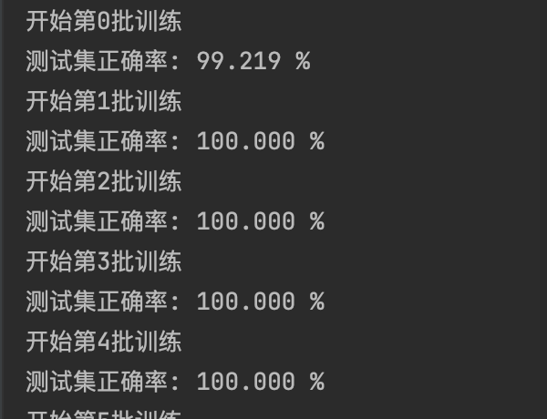
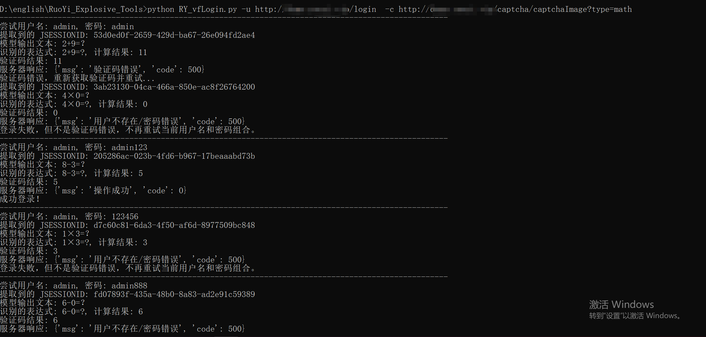
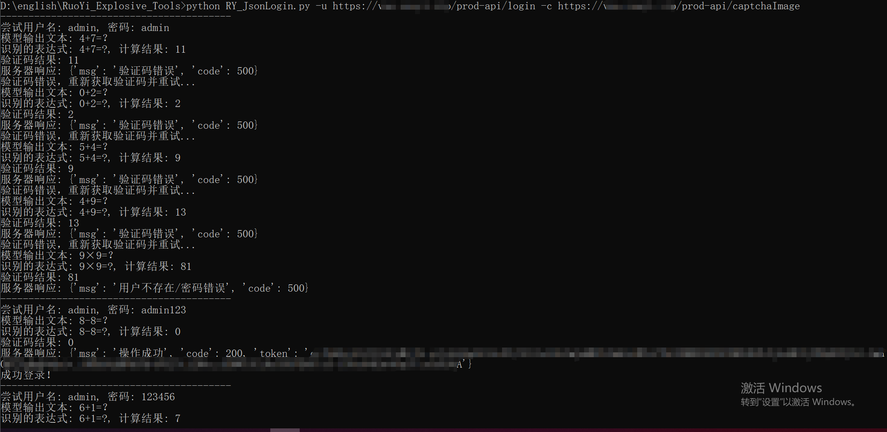

# RuoYi_Explosive_Tools
若依验证码识别爆破工具
<<<<<<< HEAD
<<<<<<< HEAD
根据https://github.com/fupinglee/CalculateCaptcha_Recognition项目基础上结合CHATGPT编写出来的若依验证码识别爆破工具,分为前后端分离版（识别率较低，使用循环来代替）和不分离版。
## 1.环境配置
下载代码
```bash
git clone https://github.com/Pei4AN/RuoYi_Explosive_Tools.git
```
安装依赖
```bash
cd RuoYi_Explosive_Tools
pip install -r requirements_gpu.txt # gpu环境 
```
>如果没有GPU环境的话使用`pip install -r requirements.txt`


## 2.训练
下载https://github.com/fupinglee/Calculate_Captcha/releases

```bash
java -jar  CalculateCaptcha.jar -n 2000 -p train
java -jar  CalculateCaptcha.jar -n 200 -p test
```
将datasets放在RuoYi_Explosive_Tools目录下

```bash
python3 train.py
```


> 可以用GPU训练，没条件就CPU训练，耗时不会太多。
> 刚开始训练正确率很快就能达到100%

## 3.识别测试

```bash
python3 test.py
```
批量测试

```python
test()
```

单个样本测试
```python
test_pic('datasets/test/xxxx.jpg')
```

网络下载新的验证码进行验证
```python
test_net("http://URL/captcha/captchaImage?type=math")
```

## 5.使用说明
username.txt和passowrd.txt分别对应上账户密码字典，可自行添加
```bash
python3 RY_vfLogin.py -h

若依（不分离版）验证码识别爆破工具

optional arguments:
  -h, --help            show this help message and exit
  -u URL, --url URL     登录接口URL
  -c CAPTCHA, --captcha CAPTCHA
                        验证码URL
  -o OUTPUT, --output OUTPUT
                        结果输出文件路径，默认生成result.txt
  -r RETRIES, --retries RETRIES
                        每组用户名和密码的最大重试次数
```
```bash
python3 RY_vfLogin.py -u http://URL/login -c http://URL/captcha/captchaImage?type=math
```



```bash
python3 RY_JsonLogin.py -h

若依（前后端分离版）验证码识别爆破工具

optional arguments:
  -h, --help            show this help message and exit
  -u URL, --url URL     登录接口URL
  -c CAPTCHA, --captcha CAPTCHA
                        验证码URL
  -o OUTPUT, --output OUTPUT
                        指定输出文件路径，默认生成result_json.txt
```

```bash
python3 RY_JsonLogin.py -u http://URL/login -c http://URL/captcha/captchaImage?type=math
```



## 6.免责声明
本工具仅面向合法授权的企业安全建设行为，如您需要测试本工具的可用性，请自行搭建靶机环境。

在使用本工具进行检测时，您应确保该行为符合当地的法律法规，并且已经取得了足够的授权。请勿对非授权目标进行扫描。

如您在使用本工具的过程中存在任何非法行为，您需自行承担相应后果，我们将不承担任何法律及连带责任。

在安装并使用本工具前，请您务必审慎阅读、充分理解各条款内容，限制、免责条款或者其他涉及您重大权益的条款可能会以加粗、加下划线等形式提示您重点注意。 除非您已充分阅读、完全理解并接受本协议所有条款，否则，请您不要安装并使用本工具。您的使用行为或者您以其他任何明示或者默示方式表示接受本协议的，即视为您已阅读并同意本协议的约束。

## 7.参考链接
https://github.com/fupinglee/CalculateCaptcha_Recognition
https://github.com/fupinglee/Calculate_Captcha
=======
>>>>>>> affa76a662e2885f68d86212059b888bf3bf8dc9
=======
>>>>>>> affa76a662e2885f68d86212059b888bf3bf8dc9
